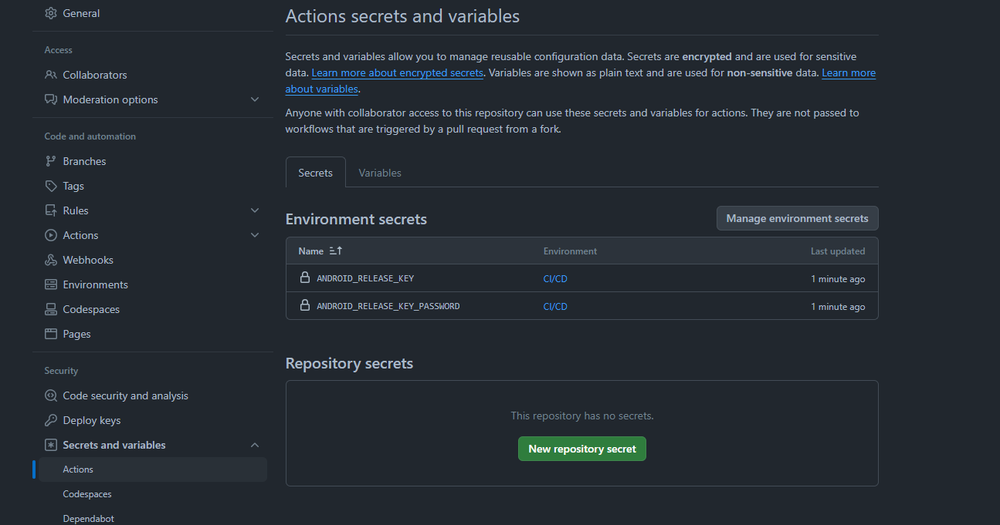

# See also

  - [flutter build ios](https://github.com/cedvdb/action-flutter-build-ios)
  - [flutter build web](https://github.com/cedvdb/action-flutter-build-web)

# 1. Create an upload keystore

Read the official documentation to setup the keystore: https://docs.flutter.dev/deployment/android#create-an-upload-keystore

If you followed the above documentation you should end up with a local file `key.properties` (not comitted to github). This github action
will recreate that file with values inside github actions secrets, for signing the application.


# 2. Add secrets values in your repository settings

add the base64 version of your upload-keystore.jks as well as the password from the previous step in your repository actions secrets

```
base64 -i path/to/upload-keystore.jks
```

You should end up with those values as secrets (you can give them any name).



# 3. Use the action

```yaml
name: Build and distribute

on:
  push:
    branches:
      - main

jobs:
  android-release-build:
    name: android-release-build
    runs-on: ubuntu-latest
    steps:
      - uses: actions/checkout@v2

      - uses: cedvdb/flutter-build-android
        with:
          keystore-base64: ${{ secrets.ANDROID_RELEASE_KEY }}
          keystore-password: "${{ secrets.ANDROID_RELEASE_KEY_PASSWORD }}"
          # optionals
          build-cmd: flutter build apk --release --flavor dev
          working-directory: ./

          
      - name: Archive APK
        uses: actions/upload-artifact@v2
        with:
          name: release-apk
          # Try running the build locally with the build command to be sure of this path
          path: build/app/outputs/flutter-apk/app-dev-release.apk
```
